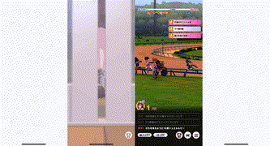
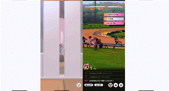
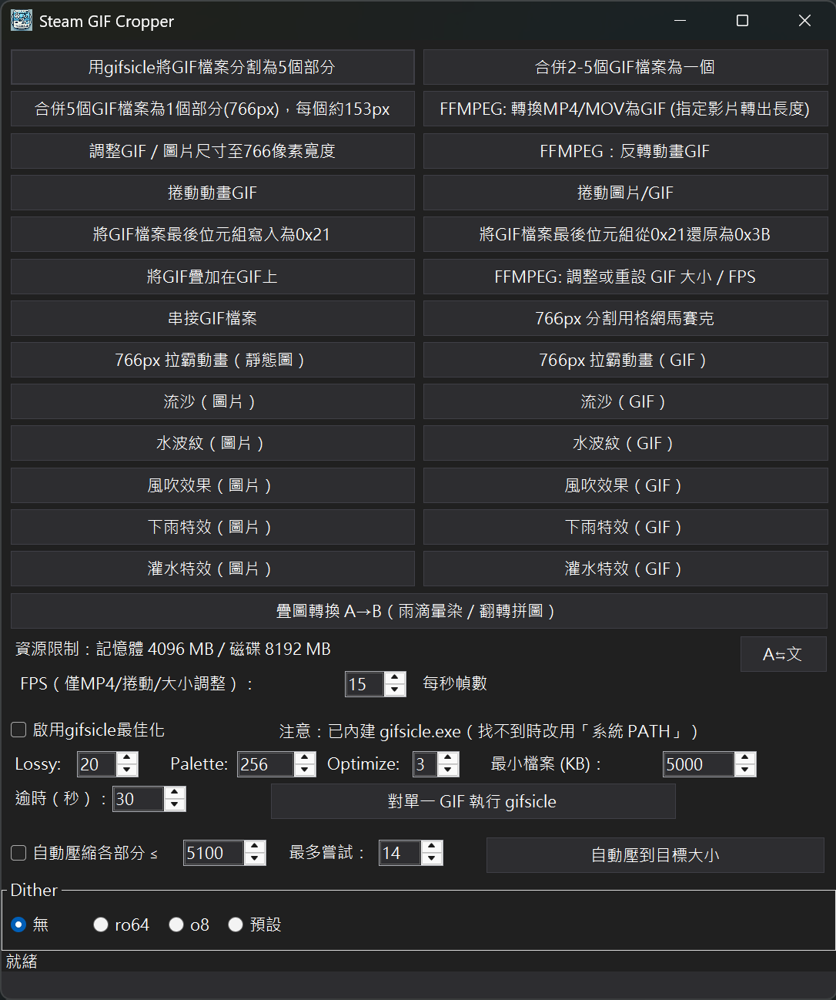
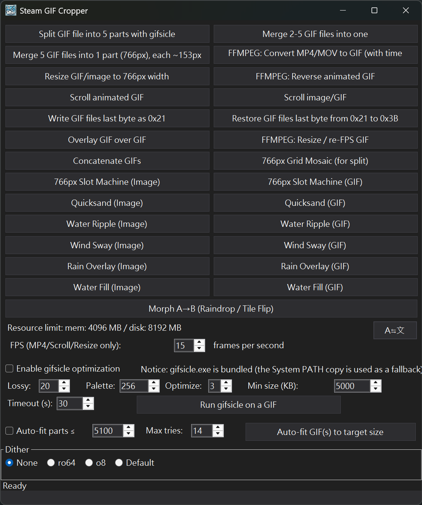
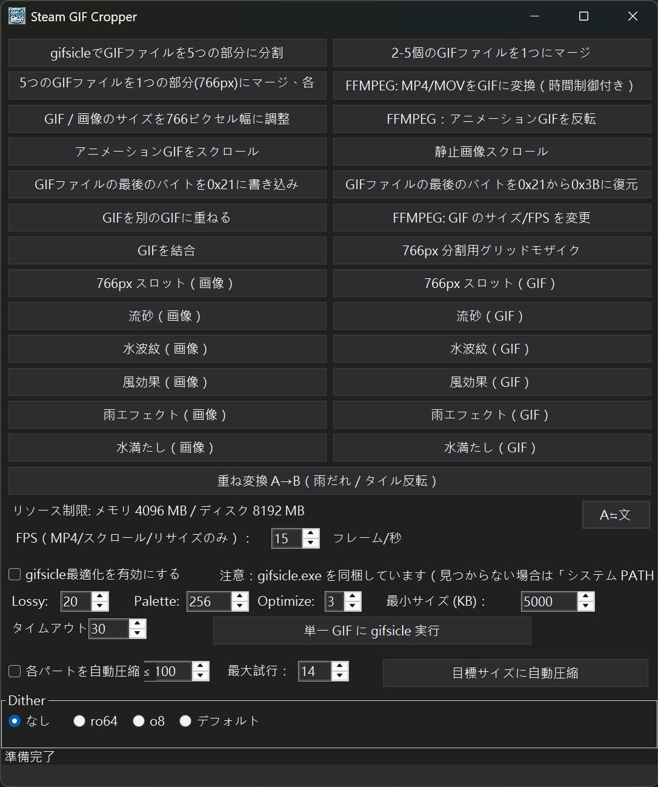

# SteamGifCropper

🌐 **繁體中文** ｜ **English** ｜ **日本語** — 展開下方對應語言區塊 / expand a section below / 下のセクションを開いてください

## 預覽 · Preview · プレビュー

下方為 SteamGifCropper v0.2.1 切出的五張 GIF；因載入時間差可能略不同步，可重新整理（F5）再看。  
Five GIFs split with SteamGifCropper v0.2.1 — they may look slightly out of sync due to load timing, refresh (F5) to re-sync.  
SteamGifCropper v0.2.1 で分割した5つの GIF。読み込み差で同期がずれて見える場合があります（F5 で再同期）。

<div style="display: flex; flex-wrap: wrap; gap: 10px;">
  
  
  
  
  
</div>

**串接 · Concatenate · 連結**
<div style="display: flex; flex-wrap: wrap; gap: 10px;">
  
</div>

**合併 · Merge · 合成**
<div style="display: flex; flex-wrap: wrap; gap: 10px;">
  
</div>

**捲動 · Scroll · スクロール**
<div style="display: flex; flex-wrap: wrap; gap: 10px;">
  
</div>

---

<details open>
<summary><b>🇹🇼 繁體中文</b></summary>

<br>

<div style="display: flex; flex-wrap: wrap; gap: 10px;">
  
</div>

SteamGifCropper 是一個設計為 **Steam 工作坊個人展示櫃**的小工具，用於對 GIF 檔案進行裁切和處理。此程式可以將寬度為 766 / 774 像素的 GIF 動畫分割成多個部分、將Gif寬度調整為 **766px** 、或是把GIF檔案最後一個位元組由0x3B改為0x21。支援 gifsicle 後段處理。

---

## 功能

- **檢查 GIF 寬度**：建議使用寬度為 **766px** 的來源檔（亦支援 **774px**）。
- **自動裁切**：依預設範圍將 GIF 分成五段，並在每段底部延伸 **100px** 透明區塊，同時保留原始幀延遲。
- **透明與高度調整**：為新增區域套用相同透明色，並還原原始高度位元資訊。
- **縮放至 766px 寬度**：提供具有進度回饋的快速縮放工具。
- **尾位元工具**：可批次將多個 GIF 檔案的最後一個位元組在 `0x3B`／`0x21` 之間切換。
- **合併並再次切割五個 GIF**：自動將輸入檔縮放（約 153px），對齊時間並建立共用調色盤，合併成 766px 預覽後再切回五個展示檔。
- **並排合併 2～5 個 GIF**：不調整寬度直接拼接，提供共用調色盤選項並在 FPS 差異過大時提出警示。
- **串接 GIF 與轉場效果**：將多個 GIF 串成單一動畫，可統一 FPS／尺寸／調色盤，並加上轉場。轉場為**動態式**（兩段在過場期間都持續播放）：淡入淡出、交叉淡化、滑動、縮放、圓形虹膜、擦除、先暗再進、模糊溶解、溶解，以及水波紋轉場。
- **逆向播放 GIF**：產生反向播放版本的 GIF。
- **MP4 → GIF 轉檔**：透過 FFmpeg 指定起始時間與長度進行轉換。
- **GIF 重疊功能**：將一個 GIF 疊加在另一個 GIF 上，輸出新的動畫。
- **捲動動畫**：讓靜態圖片或現有 GIF 依指定方向、步進、週期及自動計算的循環時間進行捲動。
- **格網馬賽克切割**：在 766px 全寬上疊與槽位邊界對齊的格線（透明或實心），讓 5 格展示櫃讀成一整片刻意的格網／馬賽克。
- **拉霸 / 777 五轉輪**：把 766px 圖片或 GIF 做成 5 槽位拉霸機，每欄垂直 wrap 捲動、由快到慢隨機停止後鎖定原圖；可定格第一幀或同步播放。
- **流沙橫向／縱向流動**：把 766px 切成 N 層，各層以不同速度橫向（或縱向）wrap 捲動，形成「下快上慢」的黏滯流體感，到設定秒數整體回歸原圖。
- **水波紋**：在圖片或 GIF 上最多滴下 3 滴水滴，各自產生擴張的阻尼波紋並互相干涉、逐像素折射；落點可用點選工具在預覽上挑或手打（含畫面外）。
- **風吹麥田（隨風搖曳）**：以行進波位移讓圖片或 GIF 像麥田般隨風起伏搖曳，提供一般與「核爆級」兩種強度。
- **下雨**：在圖片或 GIF 上疊加半透明斜向雨絲，可設定風向，並支援「雨停」逐漸淡出收尾。
- **灌水 + 水中氣泡**：水從指定方向上升淹沒畫面，水面下產生折射並透過多層上升的氣泡（透鏡效果）觀看，可設定泡泡大小、層數與**泡泡顏色**。
  > 以上創意效果輸出**單一 766px 全寬 GIF（不自動分割）**，方便彼此串接，要切 5 份時再用主視窗「切割 GIF」。
- **A→B 疊圖轉換**：將 A 圖／GIF 漸變成 B，提供多種轉場風格（雨滴顯現、方塊翻轉、聚光燈、拼圖、磚塊掉落、灌水），採「前導播放 A → 轉場 → 播放 B 剩餘」的時間軸，同樣輸出單一 766px GIF。
- **調整 GIF 尺寸與 FPS**：使用 FFmpeg（若可用）重新輸出 GIF，並提供鎖定長寬比選項。
- **gifsicle 後處理**：呼叫 `gifsicle.exe` 進行調色盤最佳化、Lossy 壓縮與抖動設定。
- **資源限制保護**：遵守 Magick.NET 設定的記憶體／磁碟限制，避免耗盡系統資源。
- **多語系與主題**：介面支援繁體中文／英文／日文，並自動切換 Windows 淺色／深色主題。

---

## 系統需求

- **操作系統**：Windows 10 1904 或更高版本
- **Runtime**：.NET 10 runtime
- **依賴函式庫**：Magick.NET（基於 ImageMagick）-- 已經內含於zip檔中
- **FFMPEG**：使用FFMPEG功能的部份，系統要先裝好FFMPEG，並設定在OS系統環境變數 **PATH** 中，否則會無法呼叫。可以直接使用 Powershell 7 下指令：`winget install ffmpeg` 安裝。
- **gifsicle.exe外部程式**：`gifsicle.exe` 現已隨程式內建（放在執行檔旁），無需另行安裝；若內建檔案遺失，會改用 OS 系統環境變數 **PATH** 中的版本作為備援。

---

## 資源限制設定

預設情況下，程式會限制 ImageMagick 的資源使用，以避免過度消耗系統資源：

- 記憶體限制：**4096 MB**
- 磁碟暫存限制：**8192 MB**

這些值可以透過以下方式覆寫：

1. **修改 `SteamGifCropper.dll.config`、`App.config`(開發時)**：在 `<appSettings>` 中設定 `ResourceLimits.MemoryMB` 與 `ResourceLimits.DiskMB`。
2. **命令列參數**：啟動程式時加入 `--memory-limit=<MB>` 或 `--disk-limit=<MB>`。

例如：

```
SteamGifCropper.exe --memory-limit=2048 --disk-limit=8192
```

同時可以透過 `SteamGifCropper.dll.config`、`App.config` 調整 FFmpeg 行為：

- `FFmpeg.TimeoutSeconds`：設定每次 FFmpeg 執行的逾時秒數（預設 300 秒）。
- `FFmpeg.Threads`：限制 FFmpeg 使用的執行緒數，`0` 表示使用預設值。

---

## 安裝與使用

### 查看GIF切割結果
- 切割處理完成後，五個裁切檔案將保存到指定的資料夾中，檔案名稱格式為：
  ```
  [原始檔案名稱]_Part1.gif
  [原始檔案名稱]_Part2.gif
  [原始檔案名稱]_Part3.gif
  [原始檔案名稱]_Part4.gif
  [原始檔案名稱]_Part5.gif
  ```
單一檔案不得大於5MB，否則上傳不了Steam，如果單一檔案大於5MB，可以針對來源GIF做調整、或是使用其它工具例如EZGif單獨調整該分割檔，但是請記得最後要再修改檔案尾位元。

### GIF 覆蓋功能
1. 點選 **Overlay GIF** 按鈕，選擇要處理的基底 GIF。
2. 選擇要疊加的 GIF 檔案，並設定 X/Y 位置。
3. 確認後將兩者合併為新的 GIF。

> 注意：疊加高解析度或大型 GIF 時，視設定可能會佔用大量記憶體。

### 並排合併 2～5 個 GIF
- 保留原始寬度直接拼接，支援建立共用調色盤。
- 偵測到來源 GIF 的 FPS 差異時會提出警示，便於事先調整。

### 合併並重新切割五個 GIF
1. 點選 **Merge & Split** 並依序加入五個 GIF 檔案。
2. 工具會自動縮放（約 153px）、對齊動畫長度並建立共用調色盤。
3. 先產生 766px 寬的合併預覽檔，再套用切割流程輸出 `*_Part1.gif` ~ `*_Part5.gif`。

### 串接 GIF 與轉場效果
1. 點選 **Concatenate GIFs** 並挑選至少兩個 GIF 檔案。
2. 設定 FPS／尺寸／調色盤的統一方式（自動、參考特定檔案或自訂）。
3. 從下拉選單選擇轉場（淡入淡出、交叉淡化、滑動 ←→↑↓、縮放、圓形虹膜、擦除、先暗再進、模糊溶解、溶解、水波紋）與時長。轉場為動態式——兩段在過場期間持續播放、並以重疊方式銜接（總長度會略縮短）。
4. 可在輸出後執行 gifsicle 最佳化。

### 捲動 GIF
- **Scroll static image**：讓 PNG、JPG 等靜態圖片依自訂方向、步進與移動次數捲動，亦可加入完整循環的緩衝區。
- **Scroll animated GIF**：支援載入 GIF，並在啟用自動計算時估算完整循環時間。

兩種模式都可搭配主視窗的 gifsicle 勾選項目進行後續最佳化。

---

## 檔案裁切範圍定義 -- **766px**
### **150px** each, **4px** gap

| 檔案部分   | X 座標範圍 |
|------------|------------|
| Part 1     | 0 - 149    |
| Part 2     | 153 - 303  |
| Part 3     | 307 - 457  |
| Part 4     | 461 - 611  |
| Part 5     | 615 - 剩下  |

## 檔案裁切範圍定義 -- **774px**
### **150px** each, **6px** gap

| 檔案部分   | X 座標範圍 |
|------------|------------|
| Part 1     | 0 - 149    |
| Part 2     | 155 - 305  |
| Part 3     | 311 - 461  |
| Part 4     | 467 - 617  |
| Part 5     | 623 - 剩下  |

---

## 注意事項

1. **切割檔案之來源GIF寬度限制**：寬度為 **766px** / **774px** 的 GIF 檔案。
1. **輸出文件格式**：程式僅支援輸出 GIF 檔案，且分割範圍與圖片高度、皆已經有預設值，無法自行定義。
1. **Steam 個人展示櫃**：請確保您的 GIF 檔案與 Steam 展示櫃要求相符，裁切後的文件可用於 Steam 個人頁面的展示。
1. **執行中可能吃掉不少記憶體**：要看GIF檔案大小了。
1. **只有試過長寛為 766px \* 432px (16:9) 及 766px \* 353px (iPhone 14 Pro影片) 的GIF**

## 已知問題
1. **不是所有的GIF皆能順利處理**：畢竟不可能測過所有相關工具。
1. **無法確認GIF製作程式相容性**：使用過Filmora和EZGif測試正常。
1. **切出來的圖片可能邊緣會有條黑線**：懶得搞了，也不知是影片製作工具、還是程式問題?

## 備考：創意工作坊轉檔方式
1. 找到想要的影片片源、或者自行製作。
1. 想辦法轉成 GIF 動畫格式，可以使用 [EZGif](https://ezgif.com/) 來做一些處理。
1. 將原始 GIF 調成寬度 **766px**。
1. 使用本程式將 **766px** 的 GIF 切成五等份 (150\*5個檔案、外加每個檔案有4px間隔、共4\*4=16)。
1. 可以使用附的 arrange.html 來測試切出來的檔案有沒有問題。
1. 各別檔案不得超過 5MB。
1. 使用 Chrome / Brave 瀏覽器上傳檔案，展示櫃上傳位址：https://steamcommunity.com/sharedfiles/edititem/767/3/
1. 要先在Browser console (按下F12後，在 console 頁) 輸入： $J('#ConsumerAppID').val(480),$J('[name=file_type]').val(0),$J('[name=visibility]').val(0);
1. 有的瀏覽器有安全措施，例如要先輸入 allow paste 後，才能執行上述動作。
1. 輸入後上傳檔案、檔名記得編號、方便後續處理。
1. 重複上傳動作、沒問題的話檔案會上傳到工作坊。
1. 在Steam個人頁面中，新增工作坊展示欄，依序把上傳的 GIF 佈置好即OK

## 備考：藝術作品上傳 / 藝術作品展示櫃
1. 上傳完圖像之後：

var num= document.getElementsByName("image_width")[0].value;
document.getElementsByName("image_height")[0].value = num-(num-1);document.getElementsByName("image_width")[0].value= num*100;

## 備考：螢幕擷圖展示櫃
document.getElementsByName("file_type")[0].value= 5;
var num= document.getElementsByName("image_width")[0].value;
document.getElementsByName("image_height")[0].value = num-(num-1);
document.getElementsByName("image_width")[0].value= num\*100;


## 註 **766px** 長寬比參考：
| **影片比例** | **轉成的長寬 (px)**     |
|--------------|-----------------------|
| 4:3          | 766px \* 575px        |
| 16:9         | 766px \* 431px        |
| 16:10        | 766px \* 479px        |
| 19.5:9       | 766px \* 353px        |
| 21:9         | 766px \* 329px        |

</details>

---

<details>
<summary><b>🇬🇧 English</b></summary>

<br>

<div style="display: flex; flex-wrap: wrap; gap: 10px;">
  
</div>

SteamGifCropper is a small tool designed for the **Steam Workshop Personal Showcase**. It crops and processes GIF files to split wide GIFs (766px or 774px width) into 5 parts, resize GIFs to 766px width, and modify GIF byte data for Steam compatibility. Supports gifsicle post-processing.

---

## Features

- **Check GIF width** – accepts source GIFs with a width of **766px** (preferred) or **774px**.
- **Automatic slicing** – splits a GIF into five parts and extends each slice with **100px** of transparent space while keeping frame delays intact.
- **Transparent adjustments** – sets the added strip to the same transparent color and restores the original height bytes.
- **Scale to 766px width** – resize any GIF to 766px wide with progress feedback.
- **Tail byte utilities** – batch toggle the final byte between `0x3B`/`0x21` for multiple GIF files.
- **Merge & split five GIFs** – resize inputs (~153px each), sync durations, build a shared palette, merge to 766px, then reslice into five showcase-ready parts.
- **Merge 2–5 GIFs side by side** – compose inputs without resizing, with shared palette options and FPS mismatch warnings.
- **Concatenate GIFs with transitions** – combine multiple GIFs into a single animation, unify FPS/dimensions/palette, and add an optional transition. Transitions are *dynamic* (both clips keep playing through the cut): fade, cross-fade, slide, zoom, iris, wipe, dip-to-black, blur dissolve, dissolve, and a ripple transition.
- **Reverse playback** – generate a reversed copy of a GIF.
- **MP4 → GIF conversion** – uses FFmpeg to convert a segment (custom start time and duration) into GIF format.
- **Overlay GIFs** – position one GIF atop another to create composite animations.
- **Scrolling animations** – create scrolling GIFs from still images or existing GIFs with direction, step size, auto-duration and loop options.
- **Grid mosaic split** – overlay slot-aligned grid lines (transparent or solid) across the full 766px so the five showcase slots read as one deliberate grid/mosaic.
- **Slot machine / 777 five reels** – turn a 766px image or GIF into a 5-reel slot machine; each column wrap-scrolls vertically and decelerates to a random stop, locking onto the original; freeze frame 0 or play along.
- **Quicksand horizontal/vertical flow** – slice the 766px into N bands that wrap-scroll at graded speeds (fast at the bottom/top/middle) for a viscous flow, returning to the original at the set duration.
- **Water ripple** – drop up to 3 water drops on an image or GIF; each emits an expanding damped ripple and they interfere, refracting the pixels; pick drop positions on a preview or type them (including off-screen).
- **Wind sway (wheat field)** – a travelling-wave displacement makes an image or GIF sway in the wind like a wheat field; normal and "nuclear" intensity modes.
- **Rain** – overlay translucent slanted rain streaks on an image or GIF, with a configurable wind direction and a "rain stops" fade-out at the end.
- **Water fill + bubbles** – water rises and floods the canvas from a chosen direction; below the surface the image is refracted and seen through multiple layers of rising lensing bubbles, with adjustable bubble size, layers and **bubble colour**.
  > These creative effects output a **single full-width 766px GIF (no auto-split)** so they can be chained; split into five with the main "Split GIF" button when ready.
- **A→B morph transition** – morph image/GIF A into B with several styles (raindrop reveal, tile flip, spotlight, jigsaw, brick drop, water fill); it uses a "pre-roll A → morph → remaining B" timeline and also outputs a single 766px GIF.
- **Resize & change frame rate** – adjust width, height and FPS (FFmpeg-based when available) with optional aspect ratio lock.
- **gifsicle support** – call `gifsicle.exe` for palette optimization, lossy compression and dithering.
- **Resource limit awareness** – enforces Magick.NET memory/disk limits to avoid exhausting system resources.
- **Multi-language & theming** – Traditional Chinese, English and Japanese UI with automatic light/dark theme support.

---

## System Requirements

- **Operating System**: Windows 10 1904 or higher
- **Runtime**: .NET 10 runtime
- **Dependencies**: Magick.NET (based on ImageMagick) -- already included in zip file
- **FFMPEG**: For features using FFMPEG functionality, the system must have FFMPEG installed and set in the OS system environment variable **PATH**, otherwise it cannot be called. You can directly install using PowerShell 7 command: `winget install ffmpeg`.
- **gifsicle.exe external program**: `gifsicle.exe` now ships bundled with the app (next to the executable), so no install is required. If the bundled copy is missing, the OS **PATH** copy is used as a fallback.

---

## Resource Limits & FFmpeg Configuration

To avoid exhausting system resources the app applies conservative Magick.NET limits by default:

- Memory: **4096 MB**
- Disk cache: **8192 MB**

You can override these values in two ways:

1. **Edit `App.config`** – set `ResourceLimits.MemoryMB` and `ResourceLimits.DiskMB` under `<appSettings>`.
2. **Command-line arguments** – launch with `--memory-limit=<MB>` and/or `--disk-limit=<MB>`.

Example:

```
SteamGifCropper.exe --memory-limit=2048 --disk-limit=8192
```

Additional FFmpeg behaviour can also be tuned via `App.config`:

- `FFmpeg.TimeoutSeconds` – per-run timeout in seconds (default: 300).
- `FFmpeg.Threads` – force a thread count (`0` = FFmpeg default).

---

## Installation & Usage

### Viewing GIF Split Results
- After split processing is complete, five cropped files will be saved to the specified folder with the following filename format:
  ```
  [OriginalFileName]_Part1.gif
  [OriginalFileName]_Part2.gif
  [OriginalFileName]_Part3.gif
  [OriginalFileName]_Part4.gif
  [OriginalFileName]_Part5.gif
  ```
Single files must not exceed 5MB, otherwise they cannot be uploaded to Steam. If a single file exceeds 5MB, you can adjust the source GIF or use other tools like EZGif to individually adjust that split file, but remember to modify the file tail byte at the end.

### Merging 2–5 GIFs
A basic merging function that keeps the original width. It builds a shared palette (with an optional faster mode) and warns when FPS differs noticeably between sources.

### Merging five GIFs into one 766px GIF
Resizes each GIF to ~153px, synchronizes duration, merges to a 766px preview GIF, and splits the result back into five showcase-ready slices in the source folder.

### Concatenating GIFs with transitions
1. Click **Concatenate GIFs** and pick at least two GIF files.
2. Choose how to unify FPS, dimensions and palette (auto, reference GIF, or custom options).
3. Pick a transition from the dropdown (fade, cross-fade, slide ←→↑↓, zoom, iris, wipe, dip-to-black, blur dissolve, dissolve, ripple) and a duration. Transitions are dynamic — both clips keep playing through the transition, which overlaps (and slightly shortens) the join.
4. Optionally run gifsicle optimization after export.

The tool creates a single GIF stitched in sequence and honours the configured resource limits.

### Scrolling GIFs
- **Scroll static image** – turn a still image (PNG, JPG, etc.) into a scrolling animation with custom direction, step size, loop count and optional full-cycle padding.
- **Scroll animated GIF** – reuse the same options, allow GIF inputs, and automatically estimate a full-cycle duration when enabled.

Both options can run gifsicle optimization when the main window checkbox is enabled.

---

## Slice Ranges – **766px**
**150px** each with a **4px** gap

| Part | X range |
|------|---------|
| Part 1 | 0 – 149 |
| Part 2 | 153 – 303 |
| Part 3 | 307 – 457 |
| Part 4 | 461 – 611 |
| Part 5 | 615 – end |

## Slice Ranges – **774px**
**150px** each with a **6px** gap

| Part | X range |
|------|---------|
| Part 1 | 0 – 149 |
| Part 2 | 155 – 305 |
| Part 3 | 311 – 461 |
| Part 4 | 467 – 617 |
| Part 5 | 623 – end |

---

## Notes

1. **Source GIF width limitation for split files**: GIF files with width of **766px** / **774px**.
1. **Output file format**: The program only supports outputting GIF files, and split ranges and image height both have default values that cannot be customized.
1. **Steam Personal Showcase**: Please ensure your GIF files comply with Steam showcase requirements; cropped files can be used for display on Steam personal pages.
1. **May consume significant memory during execution**: Depends on GIF file size.
1. **Only tested with GIFs of dimensions 766px × 432px (16:9) and 766px × 353px (iPhone 14 Pro video)**

## Known Issues
1. **Not all GIFs can be processed successfully**: After all, it's impossible to test with all related tools.
1. **Cannot confirm GIF creation program compatibility**: Tested normally with Filmora and EZGif.
1. **Split images may have black lines at edges**: Too lazy to fix, and don't know if it's an issue with video creation tools or the program?

## Reference: Creative Workshop Conversion Method
1. Find the desired video source or create your own.
1. Find a way to convert to GIF animation format, you can use [EZGif](https://ezgif.com/) for some processing.
1. Adjust the original GIF to **766px** width.
1. Use this program to split the **766px** GIF into five equal parts (150×5 files, plus 4px gap for each file, total 4×4=16).
1. You can use the included arrange.html to test if the split files have any problems.
1. Individual files must not exceed 5MB.
1. Use Chrome / Brave browser to upload files, showcase upload address: https://steamcommunity.com/sharedfiles/edititem/767/3/
1. First input in Browser console (after pressing F12, in console page): $J('#ConsumerAppID').val(480),$J('[name=file_type]').val(0),$J('[name=visibility]').val(0);
1. Some browsers have security measures, for example, you need to type "allow paste" first before executing the above action.
1. After input, upload files, remember to number the filenames for easier subsequent processing.
1. Repeat upload action, if no problems the files will be uploaded to the workshop.
1. In Steam personal page, add workshop showcase section, arrange the uploaded GIFs in order and you're done.

## Reference: Artwork Upload / Artwork Showcase
1. After uploading images:

var num= document.getElementsByName("image_width")[0].value;
document.getElementsByName("image_height")[0].value = num-(num-1);document.getElementsByName("image_width")[0].value= num*100;

## Reference: Screenshot Showcase
document.getElementsByName("file_type")[0].value= 5;
var num= document.getElementsByName("image_width")[0].value;
document.getElementsByName("image_height")[0].value = num-(num-1);
document.getElementsByName("image_width")[0].value= num*100;

---

## Reference: 766px aspect ratios
| Aspect | Resulting size (px) |
|--------|--------------------|
| 4:3    | 766 × 575 |
| 16:9   | 766 × 431 |
| 16:10  | 766 × 479 |
| 19.5:9 | 766 × 353 |
| 21:9   | 766 × 329 |

</details>

---

<details>
<summary><b>🇯🇵 日本語</b></summary>

<br>

<div style="display: flex; flex-wrap: wrap; gap: 10px;">
  
</div>

SteamGifCropper は **Steam ワークショップ個人ショーケース** 用に設計された小さなツールです。GIF ファイルを切り分けて処理し、幅の広い GIF（766px または 774px 幅）を 5 つの部分に分割したり、GIF を 766px 幅にリサイズしたり、Steam 互換性のために GIF バイトデータを変更したりできます。gifsicle の後処理をサポートしています。

---

## 機能

- **GIF の幅を確認** – ソース GIF の幅は **766px**（推奨）または **774px** に対応。
- **自動分割** – 設定済みの範囲に基づき 5 つに分割し、各パートの下に **100px** の透明領域を追加してもフレーム遅延を維持します。
- **透過と高さの調整** – 追加領域に同じ透明色を適用し、高さのバイト情報を復元します。
- **幅 766px にリサイズ** – 進捗表示付きで GIF を 766px にリサイズ。
- **末尾バイト切替ツール** – 複数の GIF の末尾バイトを `0x3B`/`0x21` に一括で切り替え。
- **5 個の GIF を統合して再分割** – 入力を約 153px に縮小し、長さを同期して共通パレットを作成。766px のプレビュー GIF を作成した後、ショーケース向けの 5 ファイルに再分割します。
- **2～5 個の GIF を横方向に結合** – リサイズせずに横並びで合成し、共通パレットの選択や FPS 差異の警告を行います。
- **GIF を連結＋トランジション** – 複数 GIF を 1 本にまとめ、FPS・サイズ・パレットを統一しながらトランジションを追加。トランジションは**ダイナミック**（切り替え中も両方のクリップが再生され続けます）：フェード、クロスフェード、スライド、ズーム、アイリス、ワイプ、黒へディップ、ブラーディゾルブ、ディゾルブ、波紋。
- **逆再生 GIF** – 逆再生バージョンを生成。
- **MP4 → GIF 変換** – FFmpeg を用いて開始時間と長さを指定した GIF を生成。
- **GIF の重ね合わせ** – 1 つの GIF を別の GIF の上に重ねて合成。
- **スクロールアニメーション** – 静止画または既存の GIF を対象に、方向・ステップ幅・ループ数・自動計算の周期を設定してスクロール GIF を作成。
- **グリッドモザイク分割** – 766px 全幅にスロット境界と揃ったグリッド線（透明または塗り）を重ね、5 つのショーケースを一枚のグリッド／モザイクとして見せます。
- **スロットマシン / 777 5リール** – 766px の画像や GIF を 5 リールのスロットに。各列が縦に wrap スクロールし、減速してランダムに停止し元画像でロック。最初のフレームで固定、または再生に同期。
- **流砂の横／縦フロー** – 766px を N 層に分割し、各層を異なる速度で横（または縦）に wrap スクロールさせ、「下が速く上が遅い」粘性のある流れを作り、設定秒数で元画像に戻します。
- **水波紋** – 画像や GIF に最大 3 滴の水滴を落とし、それぞれが広がる減衰波紋を生み出して干渉し、ピクセルを屈折させます。落下位置はプレビュー上でクリック選択、または数値入力（画面外も可）。
- **風そよぐ麦畑（風揺れ）** – 進行波の変位で画像や GIF を麦畑のように風で揺らします。通常と「核爆級」の 2 段階の強度。
- **雨** – 画像や GIF に半透明の斜めの雨筋を重ね、風向を設定でき、最後に「雨が止む」フェードアウトに対応。
- **水の注入＋気泡** – 指定方向から水位が上昇して画面を満たし、水面下では屈折し、上昇する多層のレンズ気泡を通して見えます。気泡の大きさ・層数・**気泡の色**を調整可能。
  > これらのクリエイティブ効果は**単一の 766px 全幅 GIF（自動分割なし）**を出力するため連結に便利です。5 分割する際はメイン画面の「GIF を分割」を使用します。
- **A→B モーフトランジション** – 画像／GIF の A を B へモーフィング。複数のスタイル（雨滴で出現、タイル反転、スポットライト、ジグソー、ブロック落下、水の注入）に対応し、「先行再生 A → モーフ → 残りの B」のタイムラインで、同じく単一の 766px GIF を出力します。
- **GIF のリサイズとフレームレート変更** – FFmpeg（利用可能な場合）で幅・高さ・FPS を調整し、アスペクト比ロックも可能。
- **gifsicle サポート** – `gifsicle.exe` を呼び出してパレット最適化やロッシー圧縮、ディザ設定を実行。
- **リソース制限に対応** – Magick.NET のメモリ／ディスク制限を尊重し、システムリソースの枯渇を防止。
- **多言語 & テーマ対応** – 繁體中文・English・日本語の UI と、Windows のライト／ダーク テーマに対応。

---

## 動作環境

- **オペレーティングシステム**: Windows 10 1904 以降
- **ランタイム**: .NET 10 runtime
- **依存ライブラリ**: Magick.NET（ImageMagick ベース）-- zip ファイルに既に含まれています
- **FFMPEG**: FFMPEG 機能を使用する部分では、システムに FFMPEG がインストールされ、OS システム環境変数 **PATH** に設定されている必要があります。そうでないと呼び出すことができません。PowerShell 7 で直接コマンドを使用してインストールできます: `winget install ffmpeg`。
- **gifsicle.exe 外部プログラム**: `gifsicle.exe` はアプリに同梱されるようになりました（実行ファイルの隣）。インストールは不要です。同梱ファイルが見つからない場合は、OS システム環境変数 **PATH** のコピーがフォールバックとして使用されます。

---

## リソース制限と FFmpeg 設定

アプリは既定で Magick.NET のリソース制限を適用し、過剰な消費を防ぎます。

- メモリ: **4096 MB**
- ディスク キャッシュ: **8192 MB**

以下の方法で値を上書きできます。

1. **`App.config` を編集** – `<appSettings>` 内の `ResourceLimits.MemoryMB` と `ResourceLimits.DiskMB` を設定。
2. **コマンドライン引数** – `--memory-limit=<MB>` や `--disk-limit=<MB>` を指定して起動。

例:

```
SteamGifCropper.exe --memory-limit=2048 --disk-limit=8192
```

さらに `App.config` では FFmpeg の動作も調整できます。

- `FFmpeg.TimeoutSeconds` – 実行ごとのタイムアウト秒数（既定: 300）。
- `FFmpeg.Threads` – 使用するスレッド数を指定（`0` = FFmpeg の既定値）。

---

## インストールと使用

### GIF 分割結果の確認
- 分割処理が完了すると、5 つの切り分けファイルが指定されたフォルダに保存され、ファイル名の形式は以下のようになります:
  ```
  [元のファイル名]_Part1.gif
  [元のファイル名]_Part2.gif
  [元のファイル名]_Part3.gif
  [元のファイル名]_Part4.gif
  [元のファイル名]_Part5.gif
  ```
単一ファイルは 5MB を超えてはいけません。そうでないと Steam にアップロードできません。単一ファイルが 5MB を超える場合は、ソース GIF を調整するか、EZGif などの他のツールを使用してその分割ファイルを個別に調整できますが、最後にファイルの末尾バイトを変更することを忘れないでください。

### 2～5 個の GIF を結合
元の幅のまま横方向に結合し、共通パレットの生成（高速モードあり）や FPS 差異の警告を行います。

### 5 個の GIF を 1 つの 766px GIF に結合
約 153px に縮小して同期・結合し、766px のプレビュー GIF を生成した後、再び 5 つのパーツに分割します。

### GIF を連結してトランジションを追加
1. **Concatenate GIFs** を押して 2 つ以上の GIF を選択。
2. FPS／サイズ／パレットの統一方法（自動、参照 GIF、カスタム）を設定。
3. ドロップダウンからトランジション（フェード／クロスフェード／スライド ←→↑↓／ズーム／アイリス／ワイプ／黒へディップ／ブラーディゾルブ／ディゾルブ／波紋）と時間を選択。トランジションはダイナミックで、両クリップが再生され続けながら重なって繋がります（全体の長さは少し短くなります）。
4. 出力後の gifsicle 最適化を必要に応じて有効化。

設定に応じて 1 本の連結 GIF を生成し、リソース制限を尊重して処理します。

### スクロール GIF
- **Scroll static image** – PNG・JPG などの静止画を対象に方向、ステップ幅、移動回数、フルサイクルの余白を指定してスクロール。
- **Scroll animated GIF** – GIF も読み込み可能で、自動計算を有効にすると 1 周の所要時間を推定します。

両機能とも、メイン画面の gifsicle チェックを有効にすれば最適化を同時に実行できます。

---

## 分割範囲 – **766px**
**150px** 幅、**4px** の隙間

| 部分 | X 範囲 |
|------|---------|
| Part 1 | 0 – 149 |
| Part 2 | 153 – 303 |
| Part 3 | 307 – 457 |
| Part 4 | 461 – 611 |
| Part 5 | 615 – 末尾 |

## 分割範囲 – **774px**
**150px** 幅、**6px** の隙間

| 部分 | X 範囲 |
|------|---------|
| Part 1 | 0 – 149 |
| Part 2 | 155 – 305 |
| Part 3 | 311 – 461 |
| Part 4 | 467 – 617 |
| Part 5 | 623 – 末尾 |

---

## 注意事項

1. **分割ファイルのソース GIF 幅制限**: **766px** / **774px** の幅の GIF ファイル。
1. **出力ファイル形式**: プログラムは GIF ファイルの出力のみをサポートし、分割範囲と画像の高さの両方にはカスタマイズできないデフォルト値があります。
1. **Steam 個人ショーケース**: GIF ファイルが Steam ショーケース要件に準拠していることを確認してください。切り分けファイルは Steam 個人ページでの表示に使用できます。
1. **実行中にかなりのメモリを消費する可能性があります**: GIF ファイルサイズによります。
1. **766px × 432px（16:9）および 766px × 353px（iPhone 14 Pro 動画）の GIF のみでテストされています**

## 既知の問題
1. **すべての GIF を正常に処理できるわけではありません**: 結局のところ、すべての関連ツールでテストすることは不可能です。
1. **GIF 作成プログラムの互換性を確認できません**: Filmora と EZGif で正常にテストされています。
1. **分割した画像の端に黒い線が出る場合があります**: 修正が面倒で、動画作成ツールの問題なのかプログラムの問題なのかわからない？

## 参考: クリエイティブワークショップ変換方法
1. 希望する動画ソースを見つけるか、自分で作成します。
1. GIF アニメーション形式に変換する方法を見つけます。[EZGif](https://ezgif.com/) を使用していくつかの処理を行うことができます。
1. 元の GIF を **766px** 幅に調整します。
1. このプログラムを使用して **766px** の GIF を 5 等分に分割します（150×5 ファイル、各ファイルに 4px の間隔があり、合計 4×4=16）。
1. 付属の arrange.html を使用して分割ファイルに問題がないかテストできます。
1. 個々のファイルは 5MB を超えてはいけません。
1. Chrome / Brave ブラウザを使用してファイルをアップロードします。ショーケースアップロードアドレス: https://steamcommunity.com/sharedfiles/edititem/767/3/
1. 最初にブラウザコンソール（F12 を押した後、console ページ）で入力する必要があります: $J('#ConsumerAppID').val(480),$J('[name=file_type]').val(0),$J('[name=visibility]').val(0);
1. 一部のブラウザにはセキュリティ対策があります。たとえば、上記の操作を実行する前に最初に「allow paste」を入力する必要があります。
1. 入力後にファイルをアップロードし、ファイル名に番号を付けることを忘れないでください。後続の処理が容易になります。
1. アップロード操作を繰り返します。問題がなければファイルがワークショップにアップロードされます。
1. Steam 個人ページでワークショップ展示セクションを追加し、アップロードした GIF を順番に配置すれば完了です。

## 参考: アートワークアップロード / アートワーク展示
1. 画像をアップロードした後:

var num= document.getElementsByName("image_width")[0].value;
document.getElementsByName("image_height")[0].value = num-(num-1);document.getElementsByName("image_width")[0].value= num*100;

## 参考: スクリーンショット展示
document.getElementsByName("file_type")[0].value= 5;
var num= document.getElementsByName("image_width")[0].value;
document.getElementsByName("image_height")[0].value = num-(num-1);
document.getElementsByName("image_width")[0].value= num*100;

---

## 参考: 766px 時のアスペクト比
| 比率 | 出力サイズ (px) |
|------|----------------|
| 4:3    | 766 × 575 |
| 16:9   | 766 × 431 |
| 16:10  | 766 × 479 |
| 19.5:9 | 766 × 353 |
| 21:9   | 766 × 329 |

</details>
