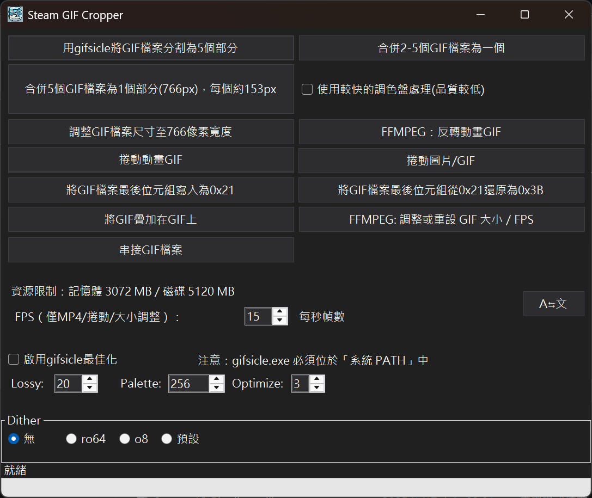

# SteamGifCropper
[English](./Readme_en.md) | [日本語](./Readme_ja.md)

<div style="display: flex; flex-wrap: wrap; gap: 10px;">
  
</div>

SteamGifCropper 是一個設計為 **Steam 工作坊個人展示櫃**的小工具，用於對 GIF 檔案進行裁切和處理。此程式可以將寬度為 766 / 774 像素的 GIF 動畫分割成多個部分、將Gif寬度調整為 **766px** 、或是把GIF檔案最後一個位元組由0x3B改為0x21。支援 gifsicle 後段處理。

---
下圖是使用SteamGifCropper v0.2.1版切出來的五張GIF圖片  
因為載入的時間差，在這看五張GIF動畫影片，可能會有點點怪怪的，會有點時間差，可以重新整理網頁看看 (PC瀏覽器上按F5即可)  

<div style="display: flex; flex-wrap: wrap; gap: 10px;">
  
  
  
  
  
</div>


---

## 功能

- **檢查 GIF 寬度**：最好使用寬度為 **766px** 的 GIF 檔案作為來源檔 (也接受 **774px**)。
- **自動裁切**：將 GIF 動畫分割為五部分，裁切範圍根據預設的 X 座標範圍執行。
- **高度擴展**：裁切後的每部分高度增加 **100px**，新增部分設置為透明背景。
- **透明色設置**：將新增部分的底部像素作為透明色，確保透明效果一致。
- **保持動畫播放速度**：保留 GIF 的Frame延遲值，確保輸出後的動畫播放速度與原始檔案一致。
- **自動修改GIF資料**：最後一位元改為0x21、第08 & 09位元改為高度增加100px前的值。
- **縮放GIF檔案至766px寬度**：提供GIF寬度縮放功能。
- **把GIF檔案最後一個位元組由0x3B改為0x21**：如果原先不是0x3B則不處理。 
- **把GIF檔案最後一個位元組由0x21改為0x3B**：如果原先不是0x21則不處理。 
- **合併五個gif為寬度為766px的GIF**：縮放到約153px等寬後，再合併。 
- **合併2~5個gif為單一的GIF**：不縮放寬度，合併後的寬度為影片寬度總和。 注意：轉換速度慢。
- **逆向播放GIF**：將選擇的GIF動畫轉換為時間逆行。
- **簡易MP4轉成GIF**：指定來源檔案、指定開始時間和長度，然後進行轉換。 沒有任何選項。
- **GIF重疊功能**：將一張GIF疊到另一張GIF上，合併後輸出到新的GIF。
- **單張圖轉成捲動GIF**：將單張靜態圖片如PNG檔，轉換成會捲動的GIF。
- **調整GIF尺寸與FPS**：指定新的寬度、高度與每秒幀數，重新輸出GIF。
- **gifsicle後續處理支援**：程式直接呼叫gifsicle.exe、對切出來的GIF檔案做最佳化。
- **支援多語系**：繁體中文、English、日本語。
- **支援Windows淺色／深色主題**：大部份視窗皆有套用到。

---

## 系統需求

- **操作系統**：Windows 10 1904 或更高版本
- **Runtime**：.NET 8 runtime
- **依賴函式庫**：Magick.NET（基於 ImageMagick）-- 已經內含於zip檔中
- **FFMPEG**：使用FFMPEG功能的部份，系統要先裝好FFMPEG，並設定在OS系統環境變數 **PATH** 中，否則會無法呼叫。可以直接使用 Powershell 7 下指令：`winget install ffmpeg` 安裝。
- **gifsicle.exe外部程式**：自行使用關鍵字例如「gifsicle for Windows」尋找、下載並設定；gifsicle.exe的位置必須包含在OS系統環境變數**PATH **中，否則會無法呼叫。
---

## 資源限制設定

預設情況下，程式會限制 ImageMagick 的資源使用，以避免過度消耗系統資源：

- 記憶體限制：**4096 MB**
- 磁碟暫存限制：**8192 MB**

這些值可以透過以下方式覆寫：

1. **修改 `SteamGifCropper.dll.config`、`App.config`(開發時)**：在 `<appSettings>` 中設定 `ResourceLimits.MemoryMB` 與 `ResourceLimits.DiskMB`。
2. **命令列參數**：啟動程式時加入 `--memory-limit=<MB>` 或 `--disk-limit=<MB>`。

例如：

```
SteamGifCropper.exe --memory-limit=2048 --disk-limit=8192
```

同時可以透過 `SteamGifCropper.dll.config`、`App.config` 調整 FFmpeg 行為：

- `FFmpeg.TimeoutSeconds`：設定每次 FFmpeg 執行的逾時秒數（預設 300 秒）。
- `FFmpeg.Threads`：限制 FFmpeg 使用的執行緒數，`0` 表示使用預設值。

---

## 安裝與使用

### 查看GIF切割結果
- 切割處理完成後，五個裁切檔案將保存到指定的資料夾中，檔案名稱格式為：
  ```
  [原始檔案名稱]_Part1.gif
  [原始檔案名稱]_Part2.gif
  [原始檔案名稱]_Part3.gif
  [原始檔案名稱]_Part4.gif
  [原始檔案名稱]_Part5.gif
  ```
單一檔案不得大於5MB，否則上傳不了Steam，如果單一檔案大於5MB，可以針對來源GIF做調整、或是使用其它工具例如EZGif單獨調整該分割檔，但是請記得最後要再修改檔案尾位元。

### GIF 覆蓋功能
1. 點選 **Overlay GIF** 按鈕，選擇要處理的基底 GIF。
2. 選擇要疊加的 GIF 檔案，並設定 X/Y 位置。
3. 確認後將兩者合併為新的 GIF。

> 注意：疊加高解析度或大型 GIF 時，視設定可能會佔用大量記憶體。

---

## 檔案裁切範圍定義 -- **766px**
### **150px** each, **4px** gap

| 檔案部分   | X 座標範圍 |
|------------|------------|
| Part 1     | 0 - 149    |
| Part 2     | 153 - 303  |
| Part 3     | 307 - 457  |
| Part 4     | 461 - 611  |
| Part 5     | 615 - 剩下  |

## 檔案裁切範圍定義 -- **774px**
### **150px** each, **6px** gap

| 檔案部分   | X 座標範圍 |
|------------|------------|
| Part 1     | 0 - 149    |
| Part 2     | 155 - 305  |
| Part 3     | 311 - 461  |
| Part 4     | 467 - 617  |
| Part 5     | 623 - 剩下  |

---

## 注意事項

1. **切割檔案之來源GIF寬度限制**：寬度為 **766px** / **774px** 的 GIF 檔案。
1. **輸出文件格式**：程式僅支援輸出 GIF 檔案，且分割範圍與圖片高度、皆已經有預設值，無法自行定義。
1. **Steam 個人展示櫃**：請確保您的 GIF 檔案與 Steam 展示櫃要求相符，裁切後的文件可用於 Steam 個人頁面的展示。
1. **執行中可能吃掉不少記憶體**：要看GIF檔案大小了。
1. **只有試過長寛為 766px \* 432px (16:9) 及 766px \* 353px (iPhone 14 Pro影片) 的GIF**

## 已知問題
1. **不是所有的GIF皆能順利處理**：畢竟不可能測過所有相關工具。
1. **無法確認GIF製作程式相容性**：使用過Filmora和EZGif測試正常。
1. **切出來的圖片可能邊緣會有條黑線**：懶得搞了，也不知是影片製作工具、還是程式問題?

## 備考：創意工作坊轉檔方式
1. 找到想要的影片片源、或者自行製作。
1. 想辦法轉成 GIF 動畫格式，可以使用 [EZGif](https://ezgif.com/) 來做一些處理。
1. 將原始 GIF 調成寬度 **766px**。
1. 使用本程式將 **766px** 的 GIF 切成五等份 (150\*5個檔案、外加每個檔案有4px間隔、共4\*4=16)。
1. 可以使用附的 arrange.html 來測試切出來的檔案有沒有問題。
1. 各別檔案不得超過 5MB。
1. 使用 Chrome / Brave 瀏覽器上傳檔案，展示櫃上傳位址：https://steamcommunity.com/sharedfiles/edititem/767/3/
1. 要先在Browser console (按下F12後，在 console 頁) 輸入： $J('#ConsumerAppID').val(480),$J('[name=file_type]').val(0),$J('[name=visibility]').val(0);
1. 有的瀏覽器有安全措施，例如要先輸入 allow paste 後，才能執行上述動作。
1. 輸入後上傳檔案、檔名記得編號、方便後續處理。
1. 重複上傳動作、沒問題的話檔案會上傳到工作坊。
1. 在Steam個人頁面中，新增工作坊展示欄，依序把上傳的 GIF 佈置好即OK

## 備考：藝術作品上傳 / 藝術作品展示櫃
1. 上傳完圖像之後：

var num= document.getElementsByName("image_width")[0].value;
document.getElementsByName("image_height")[0].value = num-(num-1);document.getElementsByName("image_width")[0].value= num*100;

## 備考：螢幕擷圖展示櫃
document.getElementsByName("file_type")[0].value= 5;
var num= document.getElementsByName("image_width")[0].value;
document.getElementsByName("image_height")[0].value = num-(num-1);
document.getElementsByName("image_width")[0].value= num\*100;


## 註 **766px** 長寬比參考：
| **影片比例** | **轉成的長寬 (px)**     |
|--------------|-----------------------|
| 4:3          | 766px \* 575px        |
| 16:9         | 766px \* 431px        |
| 16:10        | 766px \* 479px        |
| 19.5:9       | 766px \* 353px        |
| 21:9         | 766px \* 329px        |
