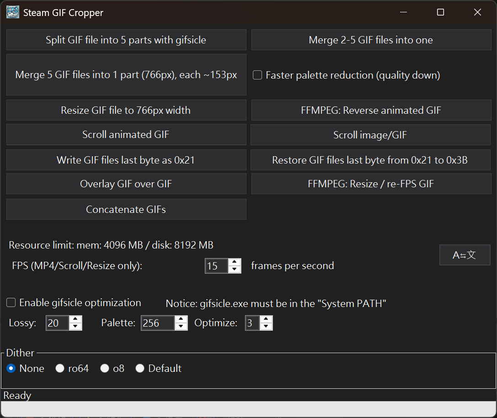

# SteamGifCropper
<div style="display: flex; flex-wrap: wrap; gap: 10px;">
  
</div>

[繁體中文](./Readme.md) | [日本語](./Readme_ja.md)

SteamGifCropper is a small tool designed for the **Steam Workshop Personal Showcase**. It crops and processes GIF files to split wide GIFs (766px or 774px width) into 5 parts, resize GIFs to 766px width, and modify GIF byte data for Steam compatibility. Supports gifsicle post-processing.

---
The images below are five GIF files split using SteamGifCropper v0.2.1  
Due to loading time differences, the five GIF animations might appear slightly out of sync when viewed here. You can refresh the page to re-sync (press F5 on PC browsers)  

<div style="display: flex; flex-wrap: wrap; gap: 10px;">
  
  
  
  
  
</div>


---

## Features

- **Check GIF width**: Best to use GIF files with **766px** width as source (also accepts **774px**).
- **Automatic cropping**: Splits GIF animations into five parts based on preset X coordinate ranges.
- **Height extension**: Each cropped part has its height increased by **100px**, with the added area set to transparent background.
- **Transparent color setting**: Sets the bottom pixels of the added area as transparent color to ensure consistent transparency effects.
- **Preserve animation playback speed**: Maintains GIF frame delay values to ensure output animation speed matches the original file.
- **Automatic GIF data modification**: Changes the last byte to 0x21, and bytes 08 & 09 to the height value before adding 100px.
- **Scale GIF files to 766px width**: Provides GIF width scaling functionality.
- **Change GIF file last byte from 0x3B to 0x21**: Only processes if original is 0x3B.
- **Change GIF file last byte from 0x21 to 0x3B**: Only processes if original is 0x21.
- **Merge five GIFs into 766px width GIF**: Scales to approximately 153px equal width, then merges.
- **Merge 2~5 GIFs into single GIF**: No width scaling, merged width equals sum of video widths. Note: Slow conversion speed.
- **Reverse GIF playback**: Converts selected GIF animation to reverse time playback.
- **Simple MP4 to GIF conversion**: Specify source file, start time and length, then convert. No options available.
- **GIF overlay function**: Overlay one GIF onto another, merge and output to new GIF.
- **Static image to scrolling GIF**: Convert static images like PNG files into scrolling GIFs.
- **Adjust GIF size and FPS**: Specify new width, height and frames per second, re-output GIF.
- **gifsicle post-processing support**: Program directly calls gifsicle.exe to optimize the split GIF files.
- **Multi-language support**: Traditional Chinese, English, Japanese.
- **Windows light/dark theme support**: Applied to most windows.

---

## System Requirements

- **Operating System**: Windows 10 1904 or higher
- **Runtime**: .NET 8 runtime
- **Dependencies**: Magick.NET (based on ImageMagick) -- already included in zip file
- **FFMPEG**: For features using FFMPEG functionality, the system must have FFMPEG installed and set in the OS system environment variable **PATH**, otherwise it cannot be called. You can directly install using PowerShell 7 command: `winget install ffmpeg`.
- **gifsicle.exe external program**: Search for and download using keywords like "gifsicle for Windows" and configure; gifsicle.exe location must be included in the OS system environment variable **PATH**, otherwise it cannot be called.
---

## Resource Limit Settings

By default, the program limits ImageMagick resource usage to avoid excessive system resource consumption:

- Memory limit: **4096 MB**
- Disk temporary limit: **8192 MB**

These values can be overridden through the following methods:

1. **Modify `SteamGifCropper.dll.config`, `App.config` (during development)**: Set `ResourceLimits.MemoryMB` and `ResourceLimits.DiskMB` in `<appSettings>`.
2. **Command line arguments**: Add `--memory-limit=<MB>` or `--disk-limit=<MB>` when starting the program.

For example:

```
SteamGifCropper.exe --memory-limit=2048 --disk-limit=8192
```

You can also adjust FFmpeg behavior through `SteamGifCropper.dll.config`, `App.config`:

- `FFmpeg.TimeoutSeconds`: Set timeout seconds for each FFmpeg execution (default 300 seconds).
- `FFmpeg.Threads`: Limit the number of threads FFmpeg uses, `0` means use default value.

---

## Installation & Usage

### Viewing GIF Split Results
- After split processing is complete, five cropped files will be saved to the specified folder with the following filename format:
  ```
  [OriginalFileName]_Part1.gif
  [OriginalFileName]_Part2.gif
  [OriginalFileName]_Part3.gif
  [OriginalFileName]_Part4.gif
  [OriginalFileName]_Part5.gif
  ```
Single files must not exceed 5MB, otherwise they cannot be uploaded to Steam. If a single file exceeds 5MB, you can adjust the source GIF or use other tools like EZGif to individually adjust that split file, but remember to modify the file tail byte at the end.

### GIF Overlay Function
1. Click the **Overlay GIF** button and select the base GIF to process.
2. Select the GIF file to overlay and set the X/Y position.
3. Confirm to merge both into a new GIF.

> Note: Overlaying high-resolution or large GIFs may consume significant memory depending on settings.

---

## Slice Ranges – **766px**
**150px** each with a **4px** gap

| Part | X range |
|------|---------|
| Part 1 | 0 – 149 |
| Part 2 | 153 – 303 |
| Part 3 | 307 – 457 |
| Part 4 | 461 – 611 |
| Part 5 | 615 – end |

## Slice Ranges – **774px**
**150px** each with a **6px** gap

| Part | X range |
|------|---------|
| Part 1 | 0 – 149 |
| Part 2 | 155 – 305 |
| Part 3 | 311 – 461 |
| Part 4 | 467 – 617 |
| Part 5 | 623 – end |

---

## Notes

1. **Source GIF width limitation for split files**: GIF files with width of **766px** / **774px**.
1. **Output file format**: The program only supports outputting GIF files, and split ranges and image height both have default values that cannot be customized.
1. **Steam Personal Showcase**: Please ensure your GIF files comply with Steam showcase requirements; cropped files can be used for display on Steam personal pages.
1. **May consume significant memory during execution**: Depends on GIF file size.
1. **Only tested with GIFs of dimensions 766px × 432px (16:9) and 766px × 353px (iPhone 14 Pro video)**

## Known Issues
1. **Not all GIFs can be processed successfully**: After all, it's impossible to test with all related tools.
1. **Cannot confirm GIF creation program compatibility**: Tested normally with Filmora and EZGif.
1. **Split images may have black lines at edges**: Too lazy to fix, and don't know if it's an issue with video creation tools or the program?

## Reference: Creative Workshop Conversion Method
1. Find the desired video source or create your own.
1. Find a way to convert to GIF animation format, you can use [EZGif](https://ezgif.com/) for some processing.
1. Adjust the original GIF to **766px** width.
1. Use this program to split the **766px** GIF into five equal parts (150×5 files, plus 4px gap for each file, total 4×4=16).
1. You can use the included arrange.html to test if the split files have any problems.
1. Individual files must not exceed 5MB.
1. Use Chrome / Brave browser to upload files, showcase upload address: https://steamcommunity.com/sharedfiles/edititem/767/3/
1. First input in Browser console (after pressing F12, in console page): $J('#ConsumerAppID').val(480),$J('[name=file_type]').val(0),$J('[name=visibility]').val(0);
1. Some browsers have security measures, for example, you need to type "allow paste" first before executing the above action.
1. After input, upload files, remember to number the filenames for easier subsequent processing.
1. Repeat upload action, if no problems the files will be uploaded to the workshop.
1. In Steam personal page, add workshop showcase section, arrange the uploaded GIFs in order and you're done.

## Reference: Artwork Upload / Artwork Showcase
1. After uploading images:

var num= document.getElementsByName("image_width")[0].value;
document.getElementsByName("image_height")[0].value = num-(num-1);document.getElementsByName("image_width")[0].value= num*100;

## Reference: Screenshot Showcase
document.getElementsByName("file_type")[0].value= 5;
var num= document.getElementsByName("image_width")[0].value;
document.getElementsByName("image_height")[0].value = num-(num-1);
document.getElementsByName("image_width")[0].value= num*100;


---

## Reference: 766px aspect ratios
| Aspect | Resulting size (px) |
|--------|--------------------|
| 4:3    | 766 × 575 |
| 16:9   | 766 × 431 |
| 16:10  | 766 × 479 |
| 19.5:9 | 766 × 353 |
| 21:9   | 766 × 329 |

