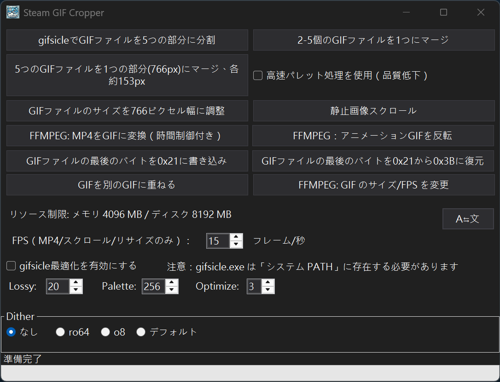
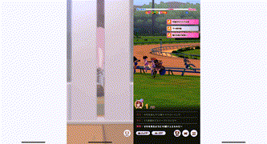
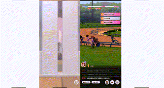

# SteamGifCropper
[繁體中文](./Readme.md) | [English](./Readme_en.md)

<div style="display: flex; flex-wrap: wrap; gap: 10px;">
  
</div>

SteamGifCropper は **Steam ワークショップ個人ショーケース** 用に設計された小さなツールです。GIF ファイルを切り分けて処理し、幅の広い GIF（766px または 774px 幅）を 5 つの部分に分割したり、GIF を 766px 幅にリサイズしたり、Steam 互換性のために GIF バイトデータを変更したりできます。gifsicle の後処理をサポートしています。

---
以下の画像は SteamGifCropper v0.2.1 で分割された 5 つの GIF ファイルです  
読み込み時間の差により、ここで 5 つの GIF アニメーションを見ると少し同期がずれて見える場合があります。ページを更新して再同期できます（PC ブラウザでは F5 キーを押してください）  

<div style="display: flex; flex-wrap: wrap; gap: 10px;">
  
  
  
  
  
</div>

連結
<div style="display: flex; flex-wrap: wrap; gap: 10px;">
  
</div>
  
合成
<div style="display: flex; flex-wrap: wrap; gap: 10px;">
  
</div>
  
スクロール
<div style="display: flex; flex-wrap: wrap; gap: 10px;">
  
</div>
  
---

## 機能


- **GIF の幅を確認** – ソース GIF の幅は **766px**（推奨）または **774px** に対応。
- **自動分割** – 設定済みの範囲に基づき 5 つに分割し、各パートの下に **100px** の透明領域を追加してもフレーム遅延を維持します。
- **透過と高さの調整** – 追加領域に同じ透明色を適用し、高さのバイト情報を復元します。
- **幅 766px にリサイズ** – 進捗表示付きで GIF を 766px にリサイズ。
- **末尾バイト切替ツール** – 複数の GIF の末尾バイトを `0x3B`/`0x21` に一括で切り替え。
- **5 個の GIF を統合して再分割** – 入力を約 153px に縮小し、長さを同期して共通パレットを作成。766px のプレビュー GIF を作成した後、ショーケース向けの 5 ファイルに再分割します。
- **2～5 個の GIF を横方向に結合** – リサイズせずに横並びで合成し、共通パレットの選択や FPS 差異の警告を行います。
- **GIF を連結＋トランジション** – 複数 GIF を 1 本にまとめ、FPS・サイズ・パレットを統一しながらフェード／スライド／ズーム／ディゾルブなどのトランジションを追加。
- **逆再生 GIF** – 逆再生バージョンを生成。
- **MP4 → GIF 変換** – FFmpeg を用いて開始時間と長さを指定した GIF を生成。
- **GIF の重ね合わせ** – 1 つの GIF を別の GIF の上に重ねて合成。
- **スクロールアニメーション** – 静止画または既存の GIF を対象に、方向・ステップ幅・ループ数・自動計算の周期を設定してスクロール GIF を作成。
- **GIF のリサイズとフレームレート変更** – FFmpeg（利用可能な場合）で幅・高さ・FPS を調整し、アスペクト比ロックも可能。
- **gifsicle サポート** – `gifsicle.exe` を呼び出してパレット最適化やロッシー圧縮、ディザ設定を実行。
- **リソース制限に対応** – Magick.NET のメモリ／ディスク制限を尊重し、システムリソースの枯渇を防止。
- **多言語 & テーマ対応** – 繁體中文・English・日本語の UI と、Windows のライト／ダーク テーマに対応。

---

## 動作環境

- **オペレーティングシステム**: Windows 10 1904 以降
- **ランタイム**: .NET 8 runtime
- **依存ライブラリ**: Magick.NET（ImageMagick ベース）-- zip ファイルに既に含まれています
- **FFMPEG**: FFMPEG 機能を使用する部分では、システムに FFMPEG がインストールされ、OS システム環境変数 **PATH** に設定されている必要があります。そうでないと呼び出すことができません。PowerShell 7 で直接コマンドを使用してインストールできます: `winget install ffmpeg`。
- **gifsicle.exe 外部プログラム**: 「gifsicle for Windows」などのキーワードで検索、ダウンロード、設定を行ってください。gifsicle.exe の場所は OS システム環境変数 **PATH** に含まれている必要があります。そうでないと呼び出すことができません。
---


## リソース制限と FFmpeg 設定

アプリは既定で Magick.NET のリソース制限を適用し、過剰な消費を防ぎます。

- メモリ: **1024 MB**
- ディスク キャッシュ: **4096 MB**

以下の方法で値を上書きできます。

1. **`App.config` を編集** – `<appSettings>` 内の `ResourceLimits.MemoryMB` と `ResourceLimits.DiskMB` を設定。
2. **コマンドライン引数** – `--memory-limit=<MB>` や `--disk-limit=<MB>` を指定して起動。

例:

```
SteamGifCropper.exe --memory-limit=2048 --disk-limit=8192
```

さらに `App.config` では FFmpeg の動作も調整できます。

- `FFmpeg.TimeoutSeconds` – 実行ごとのタイムアウト秒数（既定: 300）。
- `FFmpeg.Threads` – 使用するスレッド数を指定（`0` = FFmpeg の既定値）。

---

## 使い方

```
SteamGifCropper.exe --memory-limit=2048 --disk-limit=8192
```

`SteamGifCropper.dll.config`、`App.config` を通じて FFmpeg の動作を調整することもできます:

- `FFmpeg.TimeoutSeconds`: 各 FFmpeg 実行のタイムアウト秒数を設定（デフォルト 300 秒）。
- `FFmpeg.Threads`: FFmpeg が使用するスレッド数を制限、`0` はデフォルト値を使用することを意味します。

---

## インストールと使用

### GIF 分割結果の確認
- 分割処理が完了すると、5 つの切り分けファイルが指定されたフォルダに保存され、ファイル名の形式は以下のようになります:
  ```
  [元のファイル名]_Part1.gif
  [元のファイル名]_Part2.gif
  [元のファイル名]_Part3.gif
  [元のファイル名]_Part4.gif
  [元のファイル名]_Part5.gif
  ```
単一ファイルは 5MB を超えてはいけません。そうでないと Steam にアップロードできません。単一ファイルが 5MB を超える場合は、ソース GIF を調整するか、EZGif などの他のツールを使用してその分割ファイルを個別に調整できますが、最後にファイルの末尾バイトを変更することを忘れないでください。


### 2～5 個の GIF を結合
元の幅のまま横方向に結合し、共通パレットの生成（高速モードあり）や FPS 差異の警告を行います。

### 5 個の GIF を 1 つの 766px GIF に結合
約 153px に縮小して同期・結合し、766px のプレビュー GIF を生成した後、再び 5 つのパーツに分割します。

### GIF を連結してトランジションを追加
1. **Concatenate GIFs** を押して 2 つ以上の GIF を選択。
2. FPS／サイズ／パレットの統一方法（自動、参照 GIF、カスタム）を設定。
3. トランジション（なし／フェード／スライド／ズーム／ディゾルブ）の種類・方向・時間を指定。
4. 高速パレットモードや出力後の gifsicle 最適化を必要に応じて有効化。

設定に応じて 1 本の連結 GIF を生成し、リソース制限を尊重して処理します。

### スクロール GIF
- **Scroll static image** – PNG・JPG などの静止画を対象に方向、ステップ幅、移動回数、フルサイクルの余白を指定してスクロール。
- **Scroll animated GIF** – GIF も読み込み可能で、自動計算を有効にすると 1 周の所要時間を推定します。

両機能とも、メイン画面の gifsicle チェックを有効にすれば最適化を同時に実行できます。

---

## 分割範囲 – **766px**
**150px** 幅、**4px** の隙間

| 部分 | X 範囲 |
|------|---------|
| Part 1 | 0 – 149 |
| Part 2 | 153 – 303 |
| Part 3 | 307 – 457 |
| Part 4 | 461 – 611 |
| Part 5 | 615 – 末尾 |

## 分割範囲 – **774px**
**150px** 幅、**6px** の隙間

| 部分 | X 範囲 |
|------|---------|
| Part 1 | 0 – 149 |
| Part 2 | 155 – 305 |
| Part 3 | 311 – 461 |
| Part 4 | 467 – 617 |
| Part 5 | 623 – 末尾 |

---

## 注意事項

1. **分割ファイルのソース GIF 幅制限**: **766px** / **774px** の幅の GIF ファイル。
1. **出力ファイル形式**: プログラムは GIF ファイルの出力のみをサポートし、分割範囲と画像の高さの両方にはカスタマイズできないデフォルト値があります。
1. **Steam 個人ショーケース**: GIF ファイルが Steam ショーケース要件に準拠していることを確認してください。切り分けファイルは Steam 個人ページでの表示に使用できます。
1. **実行中にかなりのメモリを消費する可能性があります**: GIF ファイルサイズによります。
1. **766px × 432px（16:9）および 766px × 353px（iPhone 14 Pro 動画）の GIF のみでテストされています**

## 既知の問題
1. **すべての GIF を正常に処理できるわけではありません**: 結局のところ、すべての関連ツールでテストすることは不可能です。
1. **GIF 作成プログラムの互換性を確認できません**: Filmora と EZGif で正常にテストされています。
1. **分割した画像の端に黒い線が出る場合があります**: 修正が面倒で、動画作成ツールの問題なのかプログラムの問題なのかわからない？

## 参考: クリエイティブワークショップ変換方法
1. 希望する動画ソースを見つけるか、自分で作成します。
1. GIF アニメーション形式に変換する方法を見つけます。[EZGif](https://ezgif.com/) を使用していくつかの処理を行うことができます。
1. 元の GIF を **766px** 幅に調整します。
1. このプログラムを使用して **766px** の GIF を 5 等分に分割します（150×5 ファイル、各ファイルに 4px の間隔があり、合計 4×4=16）。
1. 付属の arrange.html を使用して分割ファイルに問題がないかテストできます。
1. 個々のファイルは 5MB を超えてはいけません。
1. Chrome / Brave ブラウザを使用してファイルをアップロードします。ショーケースアップロードアドレス: https://steamcommunity.com/sharedfiles/edititem/767/3/
1. 最初にブラウザコンソール（F12 を押した後、console ページ）で入力する必要があります: $J('#ConsumerAppID').val(480),$J('[name=file_type]').val(0),$J('[name=visibility]').val(0);
1. 一部のブラウザにはセキュリティ対策があります。たとえば、上記の操作を実行する前に最初に「allow paste」を入力する必要があります。
1. 入力後にファイルをアップロードし、ファイル名に番号を付けることを忘れないでください。後続の処理が容易になります。
1. アップロード操作を繰り返します。問題がなければファイルがワークショップにアップロードされます。
1. Steam 個人ページでワークショップ展示セクションを追加し、アップロードした GIF を順番に配置すれば完了です。

## 参考: アートワークアップロード / アートワーク展示
1. 画像をアップロードした後:

var num= document.getElementsByName("image_width")[0].value;
document.getElementsByName("image_height")[0].value = num-(num-1);document.getElementsByName("image_width")[0].value= num*100;

## 参考: スクリーンショット展示
document.getElementsByName("file_type")[0].value= 5;
var num= document.getElementsByName("image_width")[0].value;
document.getElementsByName("image_height")[0].value = num-(num-1);
document.getElementsByName("image_width")[0].value= num*100;


---

## 参考: 766px 時のアスペクト比
| 比率 | 出力サイズ (px) |
|------|----------------|
| 4:3    | 766 × 575 |
| 16:9   | 766 × 431 |
| 16:10  | 766 × 479 |
| 19.5:9 | 766 × 353 |
| 21:9   | 766 × 329 |

