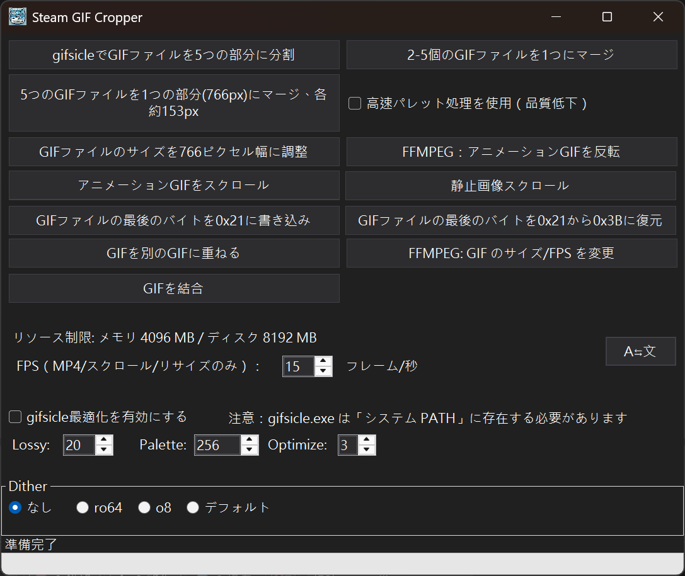

# SteamGifCropper
<div style="display: flex; flex-wrap: wrap; gap: 10px;">
  
</div>

[繁體中文](./Readme.md) | [English](./Readme_en.md)

SteamGifCropper は **Steam ワークショップ個人ショーケース** 用に設計された小さなツールです。GIF ファイルを切り分けて処理し、幅の広い GIF（766px または 774px 幅）を 5 つの部分に分割したり、GIF を 766px 幅にリサイズしたり、Steam 互換性のために GIF バイトデータを変更したりできます。gifsicle の後処理をサポートしています。

---
以下の画像は SteamGifCropper v0.2.1 で分割された 5 つの GIF ファイルです  
読み込み時間の差により、ここで 5 つの GIF アニメーションを見ると少し同期がずれて見える場合があります。ページを更新して再同期できます（PC ブラウザでは F5 キーを押してください）  

<div style="display: flex; flex-wrap: wrap; gap: 10px;">
  
  
  
  
  
</div>


---

## 機能

- **GIF 幅の確認**: ソースファイルとして幅 **766px** の GIF ファイルを使用するのが最適（**774px** も受け付けます）。
- **自動切り分け**: 設定済みの X 座標範囲に基づいて GIF アニメーションを 5 つの部分に分割します。
- **高さの拡張**: 切り分けた各部分の高さを **100px** 増加させ、追加部分は透明背景に設定します。
- **透明色の設定**: 追加部分の下端のピクセルを透明色として設定し、一貫した透明効果を保証します。
- **アニメーション再生速度の維持**: GIF のフレーム遅延値を保持し、出力後のアニメーション再生速度を元のファイルと一致させます。
- **GIF データの自動変更**: 最後のバイトを 0x21 に変更し、第 08 & 09 バイトを 100px 追加前の高さ値に変更します。
- **GIF ファイルを 766px 幅にスケール**: GIF 幅スケール機能を提供します。
- **GIF ファイルの最後のバイトを 0x3B から 0x21 に変更**: 元が 0x3B でない場合は処理しません。
- **GIF ファイルの最後のバイトを 0x21 から 0x3B に変更**: 元が 0x21 でない場合は処理しません。
- **5 つの GIF を 766px 幅の GIF に結合**: 約 153px の等幅にスケールしてから結合します。
- **2～5 個の GIF を単一の GIF に結合**: 幅のスケーリングなし、結合後の幅は動画幅の合計になります。注意: 変換速度が遅いです。
- **GIF の逆再生**: 選択した GIF アニメーションを時間逆行に変換します。
- **簡易 MP4 から GIF への変換**: ソースファイル、開始時間、長さを指定して変換します。オプションはありません。
- **GIF オーバーレイ機能**: 1 つの GIF を別の GIF に重ねて、結合後に新しい GIF に出力します。
- **静止画からスクロール GIF への変換**: PNG ファイルなどの静止画像をスクロールする GIF に変換します。
- **GIF サイズと FPS の調整**: 新しい幅、高さ、毎秒フレーム数を指定して GIF を再出力します。
- **gifsicle 後処理サポート**: プログラムが直接 gifsicle.exe を呼び出して、分割された GIF ファイルを最適化します。
- **多言語サポート**: 繁體中文、English、日本語に対応。
- **Windows ライト/ダークテーマサポート**: ほとんどのウィンドウに適用されています。

---

## 動作環境

- **オペレーティングシステム**: Windows 10 1904 以降
- **ランタイム**: .NET 8 runtime
- **依存ライブラリ**: Magick.NET（ImageMagick ベース）-- zip ファイルに既に含まれています
- **FFMPEG**: FFMPEG 機能を使用する部分では、システムに FFMPEG がインストールされ、OS システム環境変数 **PATH** に設定されている必要があります。そうでないと呼び出すことができません。PowerShell 7 で直接コマンドを使用してインストールできます: `winget install ffmpeg`。
- **gifsicle.exe 外部プログラム**: 「gifsicle for Windows」などのキーワードで検索、ダウンロード、設定を行ってください。gifsicle.exe の場所は OS システム環境変数 **PATH** に含まれている必要があります。そうでないと呼び出すことができません。
---

## リソース制限設定

デフォルトでは、プログラムは過度なシステムリソース消費を避けるため、ImageMagick のリソース使用を制限します:

- メモリ制限: **4096 MB**
- ディスク一時制限: **8192 MB**

これらの値は以下の方法で上書きできます:

1. **`SteamGifCropper.dll.config`、`App.config`（開発時）を変更**: `<appSettings>` で `ResourceLimits.MemoryMB` と `ResourceLimits.DiskMB` を設定します。
2. **コマンドライン引数**: プログラム起動時に `--memory-limit=<MB>` または `--disk-limit=<MB>` を追加します。

例:

```
SteamGifCropper.exe --memory-limit=2048 --disk-limit=8192
```

`SteamGifCropper.dll.config`、`App.config` を通じて FFmpeg の動作を調整することもできます:

- `FFmpeg.TimeoutSeconds`: 各 FFmpeg 実行のタイムアウト秒数を設定（デフォルト 300 秒）。
- `FFmpeg.Threads`: FFmpeg が使用するスレッド数を制限、`0` はデフォルト値を使用することを意味します。

---

## インストールと使用

### GIF 分割結果の確認
- 分割処理が完了すると、5 つの切り分けファイルが指定されたフォルダに保存され、ファイル名の形式は以下のようになります:
  ```
  [元のファイル名]_Part1.gif
  [元のファイル名]_Part2.gif
  [元のファイル名]_Part3.gif
  [元のファイル名]_Part4.gif
  [元のファイル名]_Part5.gif
  ```
単一ファイルは 5MB を超えてはいけません。そうでないと Steam にアップロードできません。単一ファイルが 5MB を超える場合は、ソース GIF を調整するか、EZGif などの他のツールを使用してその分割ファイルを個別に調整できますが、最後にファイルの末尾バイトを変更することを忘れないでください。

### GIF オーバーレイ機能
1. **Overlay GIF** ボタンをクリックして、処理するベース GIF を選択します。
2. オーバーレイする GIF ファイルを選択し、X/Y 位置を設定します。
3. 確認すると、両方が新しい GIF に結合されます。

> 注意: 設定によっては、高解像度や大きな GIF をオーバーレイすると大量のメモリを消費する場合があります。

---

## 分割範囲 – **766px**
**150px** 幅、**4px** の隙間

| 部分 | X 範囲 |
|------|---------|
| Part 1 | 0 – 149 |
| Part 2 | 153 – 303 |
| Part 3 | 307 – 457 |
| Part 4 | 461 – 611 |
| Part 5 | 615 – 末尾 |

## 分割範囲 – **774px**
**150px** 幅、**6px** の隙間

| 部分 | X 範囲 |
|------|---------|
| Part 1 | 0 – 149 |
| Part 2 | 155 – 305 |
| Part 3 | 311 – 461 |
| Part 4 | 467 – 617 |
| Part 5 | 623 – 末尾 |

---

## 注意事項

1. **分割ファイルのソース GIF 幅制限**: **766px** / **774px** の幅の GIF ファイル。
1. **出力ファイル形式**: プログラムは GIF ファイルの出力のみをサポートし、分割範囲と画像の高さの両方にはカスタマイズできないデフォルト値があります。
1. **Steam 個人ショーケース**: GIF ファイルが Steam ショーケース要件に準拠していることを確認してください。切り分けファイルは Steam 個人ページでの表示に使用できます。
1. **実行中にかなりのメモリを消費する可能性があります**: GIF ファイルサイズによります。
1. **766px × 432px（16:9）および 766px × 353px（iPhone 14 Pro 動画）の GIF のみでテストされています**

## 既知の問題
1. **すべての GIF を正常に処理できるわけではありません**: 結局のところ、すべての関連ツールでテストすることは不可能です。
1. **GIF 作成プログラムの互換性を確認できません**: Filmora と EZGif で正常にテストされています。
1. **分割した画像の端に黒い線が出る場合があります**: 修正が面倒で、動画作成ツールの問題なのかプログラムの問題なのかわからない？

## 参考: クリエイティブワークショップ変換方法
1. 希望する動画ソースを見つけるか、自分で作成します。
1. GIF アニメーション形式に変換する方法を見つけます。[EZGif](https://ezgif.com/) を使用していくつかの処理を行うことができます。
1. 元の GIF を **766px** 幅に調整します。
1. このプログラムを使用して **766px** の GIF を 5 等分に分割します（150×5 ファイル、各ファイルに 4px の間隔があり、合計 4×4=16）。
1. 付属の arrange.html を使用して分割ファイルに問題がないかテストできます。
1. 個々のファイルは 5MB を超えてはいけません。
1. Chrome / Brave ブラウザを使用してファイルをアップロードします。ショーケースアップロードアドレス: https://steamcommunity.com/sharedfiles/edititem/767/3/
1. 最初にブラウザコンソール（F12 を押した後、console ページ）で入力する必要があります: $J('#ConsumerAppID').val(480),$J('[name=file_type]').val(0),$J('[name=visibility]').val(0);
1. 一部のブラウザにはセキュリティ対策があります。たとえば、上記の操作を実行する前に最初に「allow paste」を入力する必要があります。
1. 入力後にファイルをアップロードし、ファイル名に番号を付けることを忘れないでください。後続の処理が容易になります。
1. アップロード操作を繰り返します。問題がなければファイルがワークショップにアップロードされます。
1. Steam 個人ページでワークショップ展示セクションを追加し、アップロードした GIF を順番に配置すれば完了です。

## 参考: アートワークアップロード / アートワーク展示
1. 画像をアップロードした後:

var num= document.getElementsByName("image_width")[0].value;
document.getElementsByName("image_height")[0].value = num-(num-1);document.getElementsByName("image_width")[0].value= num*100;

## 参考: スクリーンショット展示
document.getElementsByName("file_type")[0].value= 5;
var num= document.getElementsByName("image_width")[0].value;
document.getElementsByName("image_height")[0].value = num-(num-1);
document.getElementsByName("image_width")[0].value= num*100;


---

## 参考: 766px 時のアスペクト比
| 比率 | 出力サイズ (px) |
|------|----------------|
| 4:3    | 766 × 575 |
| 16:9   | 766 × 431 |
| 16:10  | 766 × 479 |
| 19.5:9 | 766 × 353 |
| 21:9   | 766 × 329 |

